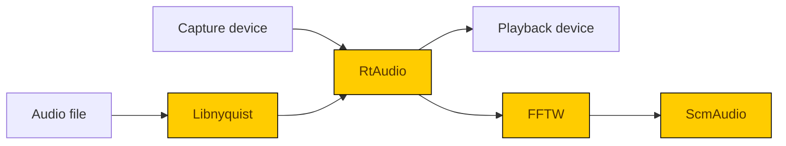

# SCM - Projet de visuels génératifs

Voici ma compréhension du projet et une proposition sur le chemin technologique à réaliser. Cette proposition s'étend de l'analyse d'un signal audio numérique jusqu'à la production du visuel, excluant donc la stratégie de captation audio et de projection vidéo.

Donc, avec l'objectif de faire en temps-réel du visuel intéressant à partir d'un signal audio également capturé en direct, je propose de:

* Développer un software aussi performant que possible pour capter et analyse le signal audio (ScmAudio)
* Utiliser Unity pour ses systèmes de particules et mouvements de caméras pour créer le visuel (ScmGenEditor)

Mon expertise concerne surtout ce premier point sur lequel je m'engage à une réalisation complète. Je suis également en mesure de faire des propositions intéressantes et de contribuer à la programmation du second volet, mais n'offre à priori aucune garantie à ce niveau.


## ScmAudio

Ce software ferait l'analyse d'un signal audio en temps réel pour en extraire les notes musicales en fonction des niveaux d'énergie des différentes bandes de fréquences. À partir de cette même technique, il sera possible d'effectuer de la détection de tempo et de donner des indications sur la quantité d'énergie dans chaque octave.

À partir de ces informations, nous obtiendrons

* déduire des couleurs musicales, les accords et gammes utilisées
* déterminer quelles sections du registres sont utilisées
* déterminer le tempo "instantané"

Afin de permettre des itérations plus rapides, le signal audio devra pouvoir provenir d'un hardware de capture ou d'un fichier audio. Il devra également être possible de produire le son en playback si désiré.


### API

L'API présentée ci-dessous sera réalisée en C++ et wrappé en C# pour être utilisée dans Unity grâce à SWIG. Cette interface a été conçu pour être utilisé en "pull", c'est-à-dire qu'elle fournira de l'information sur demande. Ceci dit, un thread sera lancé en parallèle entre chaque paire d'appels `Start()`-`Stop()` pour faire l'analyse en temps réel. `ReadSnapshot(Snapshot&)` permettra d'obtenir les informations du moment présent.

```cpp
DeviceList GetCaptureDevices();
DeviceList GetPlaybackDevices();
string SetPlaybackDevice(Device);
string SetSource(Device /*captureDevice*/);
string SetSource(string /*filePath*/);
void Start();
void Stop();
void Pause();
void Resume();
void Configure(Configuration);
void ReadSnapshot(Snapshot&);
void TapTempo();

struct Device
{
    string name;
	bool input;
    uint32 id;
    uint32 sampleRate;
    uint32 channels;
    uint32 bufferSize;
};

using DeviceList = vector<Device>;

struct Configuration
{
 	float notePresenceThreshold; // dB
    float beatDetectionThreshold; // dB
    uint32 beatDetectionWindow; // ms
    uint32 fftWindow; // samples
};

struct Snapshot
{
	float notePresence[12];
    float octaveEnergy[8];
    float tempo;
};
```


### Dépendances open-source

Les softwares open-source suivants ont été choisi afin d'accélérer la réalisation de ScmAudio et d'être en mesure de fournir des versions Windows et OSX.

#### [RtAudio](https://github.com/thestk/rtaudio)

I/O audio cross-platform qui permettra de choisir le device audio d'entrée/sortie, d'obtenir les samples de device d'entrée au format désiré et d'alimenter le device de sortie pour entendre le playback si désiré.

License MIT, nécessite uniquement une mention

#### [Libnyquist](https://github.com/ddiakopoulos/libnyquist)

Lecture de fichiers semble platform-agnostic (à confirmer) permettant de décoder/encoder plusieurs format audio. Ce sera utile pour développer expérimenter en alimentant le son par des fichiers plutôt que d'avoir à fournir un input audio en direct.

License 2-clause BSD, nécessite uniquement une mention.

#### [FFTW](http://www.fftw.org/)

Transformée de Fourier cross-platform, c'est l'élément mathématique qui fait la conversion du domaine temporel au domaine fréquentiel. C'est le pilier fondamental qui permettra l'analyse des niveaux d'énergie des différentes bandes de fréquence. 

**License GPL v2. Ce genre de licence copyleft oblige de permettre l'accès au code source du projet ET de tout projet-enfant. Une licence privée est disponible pour $12,500 (USD).**


### Aperçu du flot d'information




## ScmGenEditor

ScmGenEditor serait un package Unity incluant ScmAudio ainsi qu'un ensemble d'outils permettant de créer des "scènes génératives" en mode "édition" ou "présentation".

Les capacités suggérées seraient:

* Extraire les informations de ScmAudio de les associer à des systèmes de particules
* Importer un fichier audio ou un capture device comme source de son
* Créer des scènes génératives
  * Créer de séquences de mouvements de caméra
  * Créer et positionner des systèmes de particules
  * Associer des systèmes de particules à des paramètres spécifiques de ScmAudio
* Sauvegarder/charger les scènes génératives
* Préparer une playlist de scènes
* Manipuler les scènes avec des contrôles (changer pour la scène suivante/précédente, altérer un paramètre)